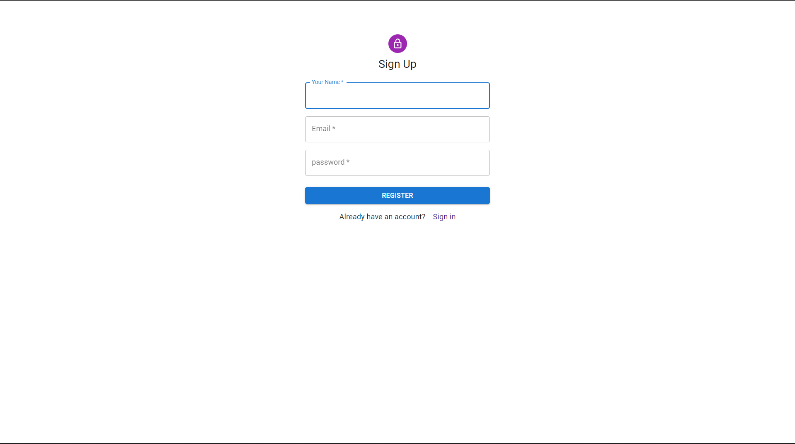
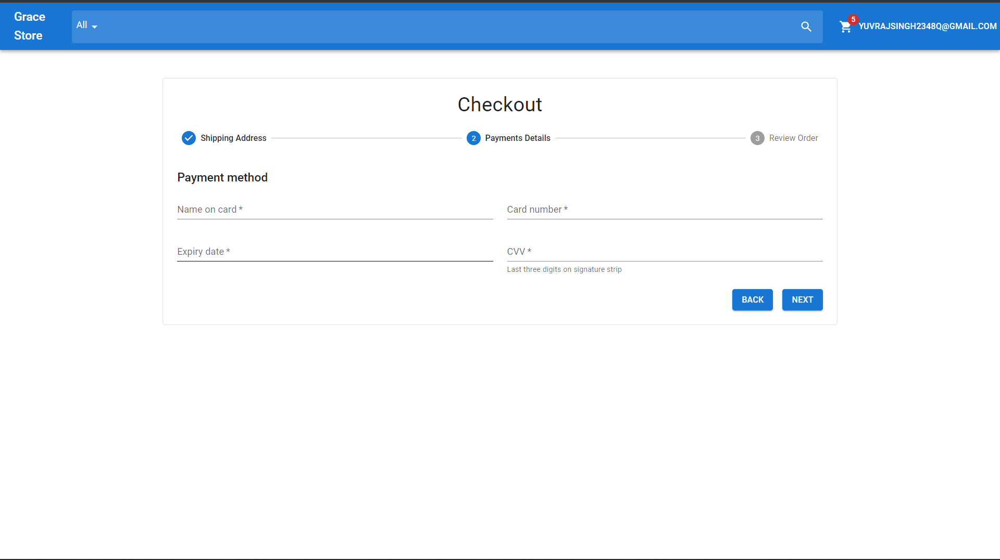

# Project Title

Grace store - ecommerce website .

# Features

- sign In / sign up
- logout
- search with auto complete
- filter
- checkout pages

## Running Tests

To run tests, run the following command

```bash
  npm run build
```

## Screenshots

- sign In / sign up page
    <!--  -->

  

- home page

  <!--  -->

- cart

  

- address page

  

- payment page
  

- order summary page

  

## Installation

Install my-project with npm

```bash
  npm install my-project
  cd my-project
```

## Demo

Insert gif or link to demo
